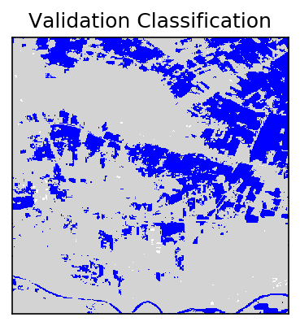
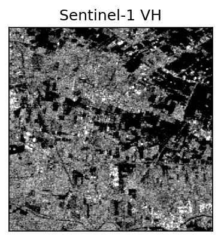
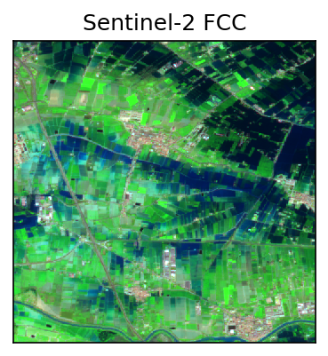

# Sen1Floods11

**NOTE: As of v1.1 of Sen1Floods11 the data has been moved to the `sen1floods11` bucket on GCS. The original v1.0 data is still hosted for now on the original `cnn_chips` bucket. v1.1 involved major restructing of the bucket and more understandable file naming as well as updates to the dataset and data format to comply with COG spec.**

Sen1Floods11: a georeferenced dataset to train and test deep learning flood algorithms for Sentinel-1 (Example). This data was generated by Cloud to Street, a Public Benefit Corporation: https://www.cloudtostreet.info/. For questions about this dataset or code please email support@cloudtostreet.info. Please cite this data as:

Bonafilia, D., Tellman, B., Anderson, T., Issenberg, E. 2020. Sen1Floods11: a georeferenced dataset to train and test deep learning flood algorithms for Sentinel-1. The IEEE/CVF Conference on Computer Vision and Pattern Recognition (CVPR) Workshops, 2020, pp. 210-211.

Available Open access at: http://openaccess.thecvf.com/content_CVPRW_2020/html/w11/Bonafilia_Sen1Floods11_A_Georeferenced_Dataset_to_Train_and_Test_Deep_Learning_CVPRW_2020_paper.html

## Dataset Access

The dataset is available for access through Google Cloud Storage bucket at: `gs://senfloods11/`

You can access the dataset bucket using the [gsutil](https://cloud.google.com/storage/docs/gsutil) command line tool. If you would like to download the entire dataset (~14 GB) you can use `gsutil rsync` to clone the bucket to a local directory. The `-m` flag is recommended to speed downloads. The `-r` flag will download sub-directories and folder recursively. See the example below.

```bash
$ gsutil -m rsync -r gs://sen1floods11 /YOUR/LOCAL/DIRECTORY/HERE
```

If using an example notebook, you can download the dataset to the folder that notebooks expect it to be in by running

```bash
$ mkdir /home/files
$ gsutil -m rsync -r gs://sen1floods11 /home/files
```

## Bucket Structure

The `sen1floods11` bucket is split into subfolders containing data, checkpoints, training/testing splits, and a [STAC](https://stacspec.org/) compliant catalog. More detail on each is provided in the docs README.

## Dataset Information

Each file follows the naming scheme EVENT_CHIPID_LAYER.tif (e.g. `Bolivia_103757_S2Hand.tif`). Chip IDs are unique, and not shared between events. Events are named by country and further information on each event (including dates) can be found in the event metadata below. Each layer has a separate GeoTIFF, and can contain multiple bands in a stacked GeoTIFF. All images are projected to WGS 84 (`EPSG:4326`) at 10 m ground resolution.

| Layer | Description                                                                                                                                              | Values                                                  | Format                                           | Bands                                                                                                                                                                                                                                                                           |
| ----- | -------------------------------------------------------------------------------------------------------------------------------------------------------- | ------------------------------------------------------- | ------------------------------------------------ | ------------------------------------------------------------------------------------------------------------------------------------------------------------------------------------------------------------------------------------------------------------------------------- |
| QC    | Hand labeled chips containing ground truth                                                                                                               | -1: No Data / Not Valid <br> 0: Not Water <br> 1: Water | GeoTIFF <br> 512 x 512 <br> 1 band <br> Int16    | 0: QC                                                                                                                                                                                                                                                                           |
| S1    | Raw Sentinel-1 imagery. <br> IW mode, GRD product <br> See [here](https://developers.google.com/earth-engine/sentinel1) for information on preprocessing | Unit: dB                                                | GeoTIFF <br> 512 x 512 <br> 2 bands <br> Float32 | 0: VV <br> 1: VH                                                                                                                                                                                                                                                                |
| S2    | Raw Sentinel-2 MSI Level-1C imagery <br> Contains all spectral bands (1 - 12) <br> Does not contain QA mask                                              | Unit: TOA reflectance <br> (scaled by 10000)            | GeoTIFF <br> 512 x 512 <br> 13 bands <br> UInt16 | 0: B1 (Coastal) <br> 1: B2 (Blue) <br> 2: B3 (Green) <br> 3: B4 (Red) <br> 4: B5 (RedEdge-1) <br> 5: B6 (RedEdge-2) <br> 6: B7 (RedEdge-3) <br> 7: B8 (NIR) <br> 8: B8A (Narrow NIR) <br> 9: B9 (Water Vapor) <br> 10: B10 (Cirrus) <br> 11: B11 (SWIR-1) <br> 12: B12 (SWIR-2) |

### Example images

A sample of the dataset for chip _Spain_7370579_ is provided at in `./sample`

<div>
  
  
  
</div>

## Example Use

[Train.ipynb](Train.ipynb) shows how to train and validate the model on a dataset.

## Event Metadata

Locations of the flood events and metadata is contained in _Sen1Floods11_Metadata.geojson_. The following fields can be found:

| Field           | Description                                                                            |
| --------------- | -------------------------------------------------------------------------------------- |
| ID              | Unique ID for each event                                                               |
| location        | Flood event location (country)                                                         |
| ISO_CC          | ISO Country Code for flood event location                                              |
| s1_date         | Date (YYYY-MM-dd) that Sentinel-1 image was acquired                                   |
| s2_date         | Date (YYYY-MM-dd) that Sentinel-2 image was acquired                                   |
| orbit           | Orbit (ASCENDING or DESCENDING) that Sentinel-1 image was acquired                     |
| rel_orbit_num   | Relative Orbit Number that Sentinel-1 image was acquired                               |
| coincident_size | Number of coincident tiles from S2                                                     |
| VH_thresh       | Threshold used for Sentinel-1 VH band to classify water in reference S1 classification |
| train_chip      | Number of chips used for training                                                      |
| val_chip        | Number of chips used for validation                                                    |
